Thermimage: Thermal Image Analysis
================

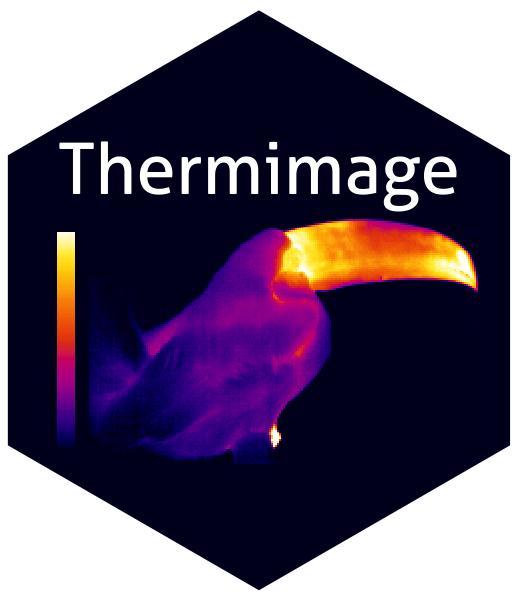


 
[](http://depsy.org/package/r/Thermimage)
[](https://zenodo.org/badge/latestdoi/33262273)

A collection of functions for assisting in converting extracted raw data
from infrared thermal images and converting them to estimated
temperatures using standard equations in thermography. Provides an open
source proxy tool for assisting with infrared thermographic analysis.

The version here on github is the current, development version. Archived
sources can be found:
<https://cran.r-project.org/src/contrib/Archive/Thermimage/>

# Current release notes

2021-09-23: Version 4.1.3 is on Github (development version)

-   minor fix to frameLocates() function to incorporate changes to
    R-devel’s use of the as.character() function.

# Features

-   Functions for importing FLIR image and video files (limited) into R.
-   Functions for converting thermal image data from FLIR based files,
    incorporating calibration information stored within each radiometric
    image file.
-   Functions for exporting calibrated thermal image data for analysis
    in open source platforms, such as ImageJ.
-   Functions for running command line conversion tools to prepare FLIR
    thermal image files for direct import into ImageJ.
-   Functions for steady state estimates of heat exchange from surface
    temperatures estimated by thermal imaging.
-   Functions for modelling heat exchange under various convective,
    short-wave, and long-wave radiative heat flux, useful in thermal
    ecology studies.

# How to Cite

Glenn J. Tattersall. (2017, December 3). Thermimage: Thermal Image
Analysis.doi: 10.5281/zenodo.1069704 (URL:
<http://doi.org/10.5281/zenodo.1069704>), R package, &lt;URL:
<https://CRAN.R-project.org/package=Thermimage>&gt;.
[](https://zenodo.org/badge/latestdoi/33262273)

# Installation

## On current R (&gt;= 3.0.0)

-   From CRAN (stable releases 1.0.+):

``` r
# install.packages("Thermimage", repos='http://cran.us.r-project.org')
```

-   Development version from Github:

``` r
# library("devtools"); install_github("gtatters/Thermimage",dependencies=TRUE)
```

## Package Imports

-   Imports: tiff, png

-   Suggests: ggplot2, fields, reshape

## OS Requirements

-   Thermimage was developed on OSX, and works well on Linux. Many
    features in Windows will require installation of command line tools
    that may or may not work as effectively. The internal R functions
    should operate fine in Windows.
-   Exiftool is required for certain functions. Installation
    instructions can be found here:
    <http://www.sno.phy.queensu.ca/~phil/exiftool/install.html> (Windows
    users might find his instructions difficult to follow, so perhaps
    try this link:
    <https://oliverbetz.de/pages/Artikel/ExifTool-for-Windows>). I
    prefer the simple solution of installing exiftool.exe directly into
    the windows folder and then verifying it has security privileges to
    run.
-   Imagemagick is required for certain functions. Installation
    instructions can be found here:
    <https://www.imagemagick.org/script/download.php>
-   Perl is required for certain functions. Installation instructions
    can be found here: <https://www.perl.org/get.html>

# Import, Export, Image Processing

## A typical thermal image


Normally, these thermal images require access to software that only runs
on Windows operating system. This package will allow you to import
certain FLIR jpgs and videos and process the images in R, and thus is
platform independent.

## Import FLIR JPG

To load a FLIR JPG, you first must install Exiftool as per instructions
above. Open sample flir jpg included with Thermimage package:

``` r
library(Thermimage)
f<-paste0(system.file("extdata/IR_2412.jpg", package="Thermimage"))
img<-readflirJPG(f, exiftoolpath="installed")
dim(img)
```

    ## [1] 480 640

The readflirJPG function has used Exiftool to figure out the resolution
and properties of the image file. Above you can see the dimensions are
listed as 480 x 640. Before plotting or doing any temperature
assessments, let’s extract the meta-tages from the thermal image file.

## Extract meta-tags from thermal image file

``` r
cams<-flirsettings(f, exiftoolpath="installed", camvals="")
head(cbind(cams$Info), 20) # Large amount of Info, show just the first 20 tages for readme
```

    ##                       [,1]    
    ## ExifToolVersionNumber 12.26   
    ## FileName              2412    
    ## Directory             ".4.0"  
    ## FileSize              638     
    ## FilePermissions       "--"    
    ## FileType              ""      
    ## FileTypeExtension     ""      
    ## MIMEType              ""      
    ## JFIFVersion           1.01    
    ## ExifByteOrder         "-"     
    ## Make                  ""      
    ## CameraModelName       660     
    ## Orientation           ""      
    ## XResolution           72      
    ## YResolution           72      
    ## ResolutionUnit        ""      
    ## Software              "1.1.98"
    ## YCbCrPositioning      ""      
    ## ExposureTime          133     
    ## ExifVersion           220

This produes a rather long list of meta-tags. If you only want to see
your camera calibration constants, type:

``` r
plancks<-flirsettings(f, exiftoolpath="installed", camvals="-*Planck*")
unlist(plancks$Info)
```

    ##      PlanckR1       PlanckB       PlanckF       PlanckO      PlanckR2 
    ##  2.110677e+04  1.501000e+03  1.000000e+00 -7.340000e+03  1.254526e-02

If you want to check the file data information, type:

``` r
cbind(unlist(cams$Dates))
```

    ##                          [,1]                 
    ## FileModificationDateTime "2021-09-23 18:46:07"
    ## FileAccessDateTime       "2021-09-23 19:08:42"
    ## FileInodeChangeDateTime  "2021-09-23 18:46:09"
    ## ModifyDate               "2013-05-09 16:22:23"
    ## CreateDate               "2013-05-09 16:22:23"
    ## DateTimeOriginal         "2013-05-09 22:22:23"

or just:

``` r
cams$Dates$DateTimeOriginal
```

    ## [1] "2013-05-09 22:22:23"

The most relevant variables to extract for calculation of temperature
values from raw A/D sensor data are listed here. These can all be
extracted from the cams output as above. I have simplified the output
below, since dealing with lists can be awkward.

``` r
ObjectEmissivity<-  cams$Info$Emissivity              # Image Saved Emissivity - should be ~0.95 or 0.96
dateOriginal<-cams$Dates$DateTimeOriginal             # Original date/time extracted from file
dateModif<-   cams$Dates$FileModificationDateTime     # Modification date/time extracted from file
PlanckR1<-    cams$Info$PlanckR1                      # Planck R1 constant for camera  
PlanckB<-     cams$Info$PlanckB                       # Planck B constant for camera  
PlanckF<-     cams$Info$PlanckF                       # Planck F constant for camera
PlanckO<-     cams$Info$PlanckO                       # Planck O constant for camera
PlanckR2<-    cams$Info$PlanckR2                      # Planck R2 constant for camera
ATA1<-        cams$Info$AtmosphericTransAlpha1        # Atmospheric Transmittance Alpha 1
ATA2<-        cams$Info$AtmosphericTransAlpha2        # Atmospheric Transmittance Alpha 2
ATB1<-        cams$Info$AtmosphericTransBeta1         # Atmospheric Transmittance Beta 1
ATB2<-        cams$Info$AtmosphericTransBeta2         # Atmospheric Transmittance Beta 2
ATX<-         cams$Info$AtmosphericTransX             # Atmospheric Transmittance X
OD<-          cams$Info$ObjectDistance                # object distance in metres
FD<-          cams$Info$FocusDistance                 # focus distance in metres
ReflT<-       cams$Info$ReflectedApparentTemperature  # Reflected apparent temperature
AtmosT<-      cams$Info$AtmosphericTemperature        # Atmospheric temperature
IRWinT<-      cams$Info$IRWindowTemperature           # IR Window Temperature
IRWinTran<-   cams$Info$IRWindowTransmission          # IR Window transparency
RH<-          cams$Info$RelativeHumidity              # Relative Humidity
h<-           cams$Info$RawThermalImageHeight         # sensor height (i.e. image height)
w<-           cams$Info$RawThermalImageWidth          # sensor width (i.e. image width)
```

## Convert raw binary to temperature

Now you have the img loaded, look at the values:

``` r
str(img)
```

    ##  int [1:480, 1:640] 18090 18074 18064 18061 18081 18057 18092 18079 18071 18071 ...

If stored with a TIFF header, the data load in as a pre-allocated matrix
of the same dimensions of the thermal image, but the values are integers
values, in this case \~18000. The data are stored as in binary/raw
format at 2^16 bits of resolution = 65536 possible values, starting at
0. These are not temperature values. They are, in fact, radiance values
or absorbed infrared energy values in arbitrary units. That is what the
calibration constants are for. The conversion to temperature is a
complicated algorithm, incorporating Plank’s law and the Stephan
Boltzmann relationship, as well as atmospheric absorption, camera IR
absorption, emissivity and distance to namea few. Each of these
raw/binary values can be converted to temperature, using the raw2temp
function:

``` r
temperature<-raw2temp(img, ObjectEmissivity, OD, ReflT, AtmosT, IRWinT, IRWinTran, RH,
                      PlanckR1, PlanckB, PlanckF, PlanckO, PlanckR2, 
                      ATA1, ATA2, ATB1, ATB2, ATX)
str(temperature)      
```

    ##  num [1:480, 1:640] 23.7 23.6 23.6 23.6 23.7 ...

The raw binary values are now expressed as temperature in degrees
Celsius (apologies to Lord Kelvin). Let’s plot the temperature data:

``` r
library(fields) # should be imported when installing Thermimage
plotTherm(temperature, h=h, w=w, minrangeset=21, maxrangeset=32)
```

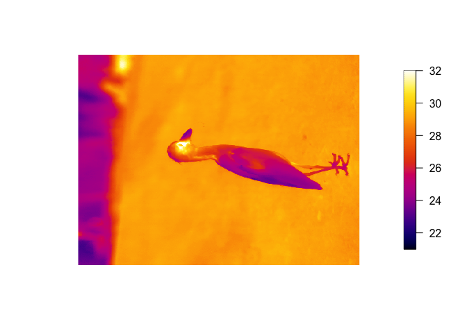<!-- -->

The FLIR jpg imports as a matrix, but default plotting parameters leads
to it being rotated 270 degrees (counter clockwise) from normal
perspective, so you should either rotate the matrix data before
plotting, or include the rotate270.matrix transformation in the call to
the plotTherm function:

``` r
plotTherm(temperature, w=w, h=h, minrangeset = 21, maxrangeset = 32, trans="rotate270.matrix")
```

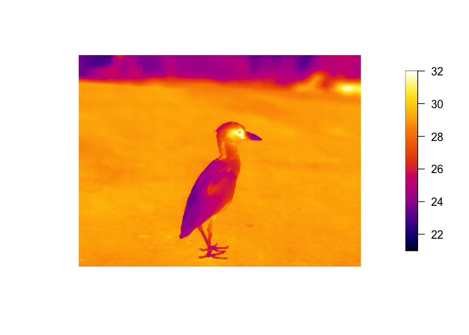<!-- -->

If you prefer a different palette:

``` r
plotTherm(temperature, w=w, h=h, minrangeset = 21, maxrangeset = 32, trans="rotate270.matrix", 
          thermal.palette=rainbowpal)
```

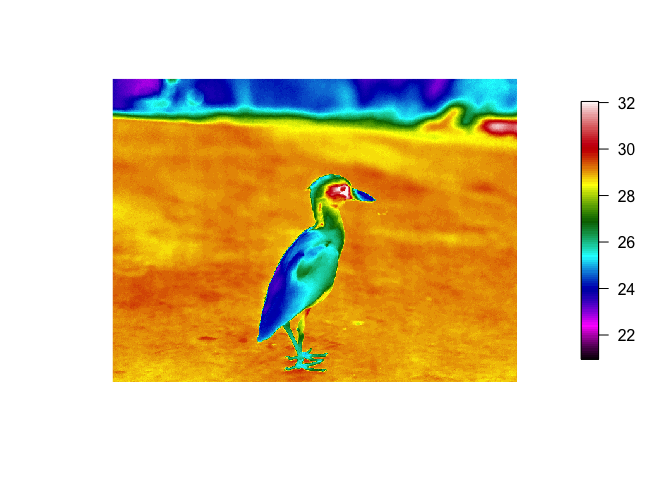<!-- -->

``` r
plotTherm(temperature, w=w, h=h, minrangeset = 21, maxrangeset = 32, trans="rotate270.matrix", 
          thermal.palette=glowbowpal)
```

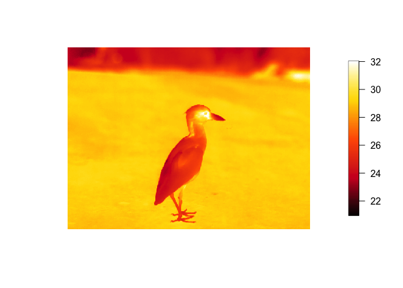<!-- -->

``` r
plotTherm(temperature, w=w, h=h, minrangeset = 21, maxrangeset = 32, trans="rotate270.matrix", 
          thermal.palette=midgreypal)
```

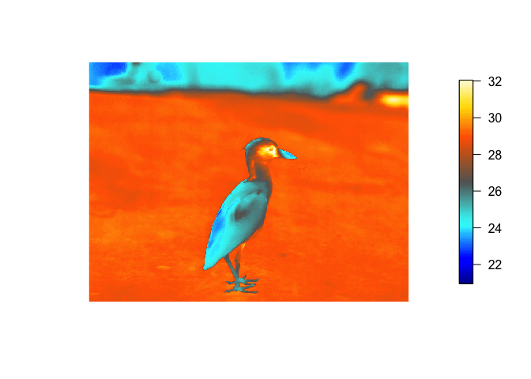<!-- -->

``` r
plotTherm(temperature, w=w, h=h, minrangeset = 21, maxrangeset = 32, trans="rotate270.matrix", 
          thermal.palette=midgreenpal)
```

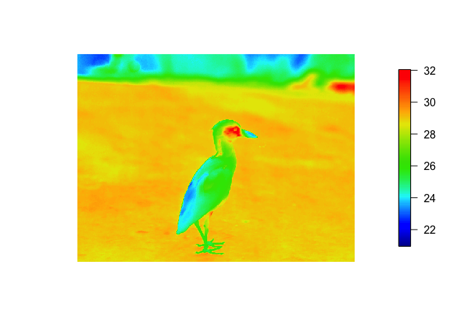<!-- -->

``` r
plotTherm(temperature, w=w, h=h, minrangeset = 21, maxrangeset = 32, trans="rotate270.matrix", 
          thermal.palette=rainbow1234pal)
```

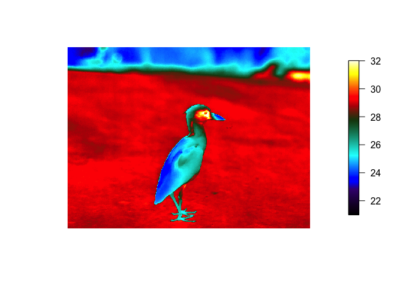<!-- -->

## Deconvolute temperature to raw and back to temperature

With thermal imaging analysis, there are at least 7 environmental
parameters that must be known to convert raw to temperature. Sometimes,
the parameters might have been incorrectly input by the user or changing
the parameters is too cumbersome in the commercial software. temp2raw()
is the inverse of raw2temp(), which allows you to convert an estimated
temperature back to the raw values (i.e. deconvolute), using the initial
object parameters used.

For example, convert a temperature estimated at 23 degrees C, under the
default blackbody conditions:

``` r
temp2raw(23, E=1, OD=0, RTemp=20, ATemp=20, IRWTemp=20, IRT=1, RH=50, PR1=21106.77, PB=1501, PF=1, PO=-7340, PR2=0.012545258)
```

    ## [1] 17994.06

Which yields a raw value of 17994.06 (using the calibration constants
above). Now you can use raw2temp to calculate a better estimate of an
object that has emissivity=0.95, distance=1m, window transmission=0.96,
all temperatures=20C, 50 RH:

``` r
raw2temp(17994.06, E=0.95, OD=1, RTemp=20, ATemp=20, IRWTemp=20, IRT=0.96, RH=50, PR1=21106.77, PB=1501, PF=1, PO=-7340, PR2=0.012545258)
```

    ## [1] 23.31223

Note: the default calibration constants for my FLIR camera will be used
if you leave out the calibration data during this two step process, but
it is more appropriate to look up your camera’s calibrations constants
using the flirsettings() function.

## How accurate is the raw2temp() conversion

See the following github for an explanation and break-down of the
conversion process and comparison to existing commercial software:

<https://github.com/gtatters/ThermimageCalibration>

## Export Image or Video

Finding a way to quantitatively analyse thermal images in R is a
challenge due to limited interactions with the graphics environment.
Thermimage has a function that allows you to write the image data to a
file format that can be easily imported into ImageJ.

First, the image matrix needs to be transposed (t) to swap the row
vs. column order in which the data are stored, then the temperatures
need to be transformed to a vector, a requirement of the writeBin
function. The function writeFlirBin is a wrapper for writeBin, and uses
information on image width, height, frame number and image interval (the
latter two are included for thermal video saves) but are kept for
simplicity to contruct a filename that incorporates image information
required when importing to ImageJ:

``` r
writeFlirBin(as.vector(t(temperature)), templookup=NULL, w=w, h=h, I="", rootname="Uploads/FLIRjpg")
```

The raw file can be found here:
<https://github.com/gtatters/Thermimage/blob/master/Uploads/FLIRjpg_W640_H480_F1_I.raw?raw=true>

## Import Raw File into ImageJ

The .raw file is simply the pixel data saved in raw format but with real
32-bit precision. This means that the temperature data (negative or
positive values) are encoded in 4 byte chunks. ImageJ has a plethora of
import functions, and the File–&gt;Import–&gt;Raw option provides great
flexibility. Once opening the .raw file in ImageJ, set the width,
height, number of images (i.e. frames or stacks), byte storage order
(little endian), and hyperstack (if desired):


The image imports clearly just as it would in a thermal image program.
Each pixel stores the calculated temperatures as provided from the
raw2temp function above.


## Importing Thermal Videos

Importing thermal videos (March 2017: still in development) is a little
more involved and less automated. I don’t really recommend using R to
work with thermal videos since the memory limitations and speed are not
efficient for large video files. It is better to convert videos to
individual files and import them frame by frame, or use an ImageJ
alternative.

But below are steps that have worked for seq and fcf files tested.

Set file info and extract meta-tags as done above:

``` r
# set filename as v
v<-paste0(system.file("extdata/SampleSEQ.seq", package="Thermimage"))

# Extract camera values using Exiftool (needs to be installed)
camvals<-flirsettings(v)
w<-camvals$Info$RawThermalImageWidth
h<-camvals$Info$RawThermalImageHeight
```

Create a lookup variable to convert the raw binary to actual temperature
estimates, use parameters relevant to the experiment. You could use the
values stored in the FLIR meta-tags, but these are not necessarily
correct for the conditions of interest. suppressWarnings() is used
because of NaN values returned for binary values that fall outside the
range.

``` r
suppressWarnings(
templookup<-raw2temp(raw=1:65536, E=camvals$Info$Emissivity, OD=camvals$Info$ObjectDistance, RTemp=camvals$Info$ReflectedApparentTemperature, ATemp=camvals$Info$AtmosphericTemperature, IRWTemp=camvals$Info$IRWindowTemperature, IRT=camvals$Info$IRWindowTransmission, RH=camvals$Info$RelativeHumidity, PR1=camvals$Info$PlanckR1,PB=camvals$Info$PlanckB,PF=camvals$Info$PlanckF,PO=camvals$Info$PlanckO,PR2=camvals$Info$PlanckR2)
)
plot(templookup, type="l", xlab="Raw Binary 16 bit Integer Value", ylab="Estimated Temperature (C)")
```

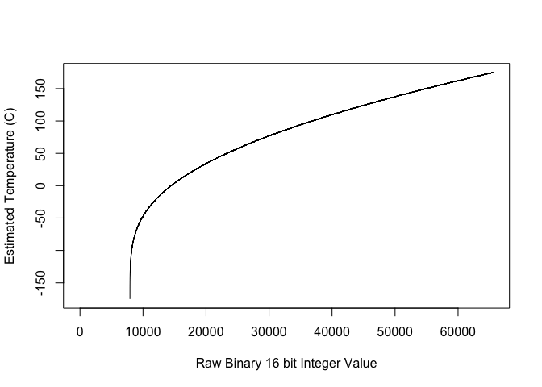<!-- -->

The advantage of using the templookup variable is in its index capacity.
For computations involving large files, this is most efficient way to
convert the raw binary values rapidly without having to call the
raw2temp function repeatedly. Thus, for a raw binary value of 17172,
18273, and 24932:

``` r
templookup[c(17172, 18273, 24932)-1]
```

    ## [1] 18.30355 24.77367 57.07398

``` r
# subtract - 1, since R uses 1 rather than 0 as the base starting index value
```

We will use the templookup later on, but first to detect where the image
frames can be found in the video file. Using the width and height
information, we use this to find where in the video file these are
stored. This corresponds to reproducible locations in the frame header:

``` r
fl<-frameLocates(v, w, h)
n.frames<-length(fl$f.start)
n.frames; fl
```

    ## [1] 2

    ## $h.start
    ## [1]    320 617372
    ## 
    ## $f.start
    ## [1]   2748 619800

The relative positions of the header start (h.start) are 320 and 617372,
and the frame start (f.start) positions are 2748 and 619800. The video
file is a short, two frame (n.frames) sequence from a thermal video.

Then pass the fl data to two different functions, one to extract the
time information from the header, and the other to extract the actual
pixel data from the image frame itself. The lapply function will have to
be used (for efficiency), but to wrap the function across all possible
detected image frames. Note: For large files, the parallel function,
mclapply, is advised (?getFrames for an example):

``` r
extract.times<-do.call("c", lapply(fl$h.start, getTimes, vidfile=v))
data.frame(extract.times)
```

    ##                  extract.times
    ## 1 2012-06-13 15:52:08.698-0500
    ## 2 2012-06-13 15:52:12.665-0500

``` r
Interval<-signif(mean(as.numeric(diff(as.POSIXct(extract.times)))),3)
Interval
```

    ## [1] 3.97

This particular sequence was actually captured at 0.03 sec intervals,
but the sample file in the package was truncated to only two frames to
minimise online size requirements for CRAN. At present, the getTimes
function might not accurately render the time on the first frame. On the
original 100 frame file, it accurately captures the real time stamps, so
the error is appears to be how FLIR saves time stamps (save time
vs. modification time vs. original time appear highly variable in .seq
and .fcf files). Precise time capture is not crucial but is helpful for
verifying data conversion.

After extracting times, then extract the frame data, with the getFrames
function:

``` r
alldata<-unlist(lapply(fl$f.start, getFrames, vidfile=v, w=w, h=h))
class(alldata); length(alldata)/(w*h)
```

    ## [1] "integer"

    ## [1] 2

The raw binary data are stored as an integer vector.
length(alldata)/(w\*h) verifies the total \# of frames in the video file
is 2.

It is best to convert the temperature data in the following manner,
although depending on file size and system limits, you may wish to delay
converting to temperature until writing the file.

``` r
alltemperature<-templookup[alldata]
head(alldata)
```

    ## [1] 17870 17833 17808 17829 17829 17861

``` r
head(alltemperature)
```

    ## [1] 22.46279 22.24723 22.10131 22.22390 22.22390 22.41040

I recommend converting the binary and/or temperature variables to a
matrix class, where each column represents a separate image frame, while
the individual rows correspond to unique pixel positions. Pixels are
filled into the row values the same way across all frames. Dataframes
and arrays are much slower for processing large files.

``` r
alldata<-unname(matrix(alldata, nrow=w*h, byrow=FALSE))
alltemperature<-unname(matrix(alltemperature, nrow=w*h, byrow=FALSE))
dim(alltemperature)
```

    ## [1] 307200      2

Frames extracted from thermal vids are upside down, so use the
mirror.matrix function inside the plotTherm function.

``` r
plotTherm(alltemperature[,1], w=w, h=h, trans="mirror.matrix")
```

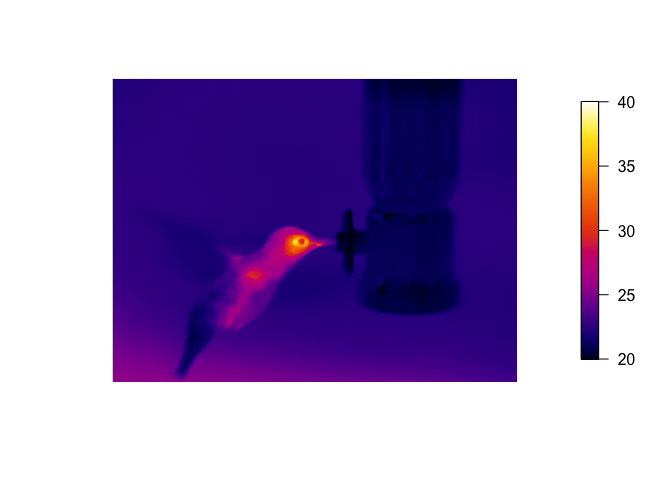<!-- -->

``` r
plotTherm(alltemperature[,2], w=w, h=h, trans="mirror.matrix")
```

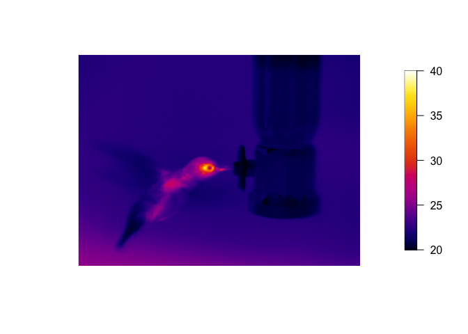<!-- -->

These files can be found:

<https://github.com/gtatters/Thermimage/blob/master/Uploads/SampleSEQ1.png?raw=true>
<https://github.com/gtatters/Thermimage/blob/master/Uploads/SampleSEQ2.png?raw=true>

Now, export entire sequence to a raw bin for opening in ImageJ -
smallish file size

``` r
writeFlirBin(bindata=alldata, templookup, w, h, Interval, rootname="Uploads/SampleSEQ")
```

The newly written 32-bit video file
(<https://github.com/gtatters/Thermimage/blob/master/Uploads/SampleSEQ_W640_H480_F2_I3.97.raw?raw=true>)
can now be imported into ImageJ, as desribed above for the single image.
Each frame is converted into a stack in ImageJ.

Note: 32-bit video files can be large and difficult to load into ImageJ.
Approaches involving direct import of flir video files is recommended
and under development.

# Convert FLIR JPG from R

If you have a lot of files and wish simply to analyse images in ImageJ,
not in R, then you will want to bulk convert these files. The following
methods are available in R, but are based on command line tools that are
also described in
<https://github.com/gtatters/ThermimageBash/blob/master/README.md>

### Download and extract sample files:

<https://github.com/gtatters/ThermImageJ/blob/master/SampleFiles.zip>

``` bash
ls SampleFLIR
```

    ## SampleFLIR.jpg
    ## SampleFLIR.png
    ## SampleFLIRCSQ.csq
    ## SampleFLIRONE.jpg
    ## SampleFLIRSEQ.seq
    ## output

### Download and extract perl scripts to scripts folder:

<https://github.com/gtatters/Thermimage/blob/master/Uploads/perl.zip>

``` bash
cd ~/IRconvert/scripts
ls
```

    ## AVIClean
    ## CompleteCSQConvert
    ## CompleteFLIRJPGConvert
    ## CompleteSEQConvert
    ## ConcatMP4
    ## ConvertACQtoTXT
    ## ConvertCSQtoAVI
    ## ConvertFCFtoAVI
    ## ConvertFLIRJPG.sh
    ## ConvertFLIRJPGtoRAW
    ## ConvertFLIRJPGtoTIFF
    ## ConvertFLIRJPGtoTIFFbyline
    ## ConvertFLIRRAWtoTIFF
    ## ConvertSEQtoAVI
    ## ConverttoGrayscale
    ## Detecting Frozen Frames.docx
    ## ExtractAllFLIRJPGs
    ## FFFTimeStamps
    ## FLIRFocalDistance
    ## FLIRFrozenFrameDetect
    ## FLIRFrozenFrameExtracts.pl
    ## FLIRMedianRangeExtracts.pl
    ## FrameDifference
    ## IRFileImport.R
    ## OldFiles
    ## RenumberFiles
    ## Sample Exiftool Commands.docx
    ## convertcsq.pl
    ## ffmpegscript
    ## flirclean.pl
    ## imagejscript_rad2temp
    ## scrapcode
    ## split.pl
    ## ~$iftool commands.docx

Bulk FLIR jpg file:

``` r
library(Thermimage)
exiftoolpath <- "installed"

f<-paste0("SampleFLIR/SampleFLIR.jpg")

# if JPG contains raw thermal image as TIFF, endian = "lsb"
# if JPG contains raw thermal image as PNG, endian = "msb"?

vals<-flirsettings(f)
w<-vals$Info$ImageWidth
h<-vals$Info$ImageHeight
res.in<-paste0(w,"x",h)
  
if(vals$Info$RawThermalImageType=="PNG") endian="msb" 
if(vals$Info$RawThermalImageType=="TIFF") endian="lsb"
  
convertflirJPG(f, exiftoolpath="installed", res.in=res.in, endian=endian, outputfolder="", verbose=FALSE)
  
cat("\n")
```

Converted files are in the output subfolder

Here is a sample image:


The above PNG file is a sample image of the 16 bit grayscale image.
Although it looks washed out, it can be imported into ImageJ and the
Brightness/Contrast changed for optimal viewing.

# Convert FLIR SEQ or CSQ from R

Convert FLIR csq file

``` r
library(Thermimage)
setwd("/Users/GlennTattersall/Documents/GitHub/ThermimageProjects/Thermimage/SampleFLIR")
exiftoolpath <- "installed"
perlpath <- "installed"

f<-"SampleFLIRCSQ.csq"

# if JPG contains raw thermal image as TIFF, endian = "lsb"
# if JPG contains raw thermal image as PNG,  endian = "msb"

vals<-flirsettings(f)
w<-vals$Info$RawThermalImageWidth
h<-vals$Info$RawThermalImageHeight
res.in<-paste0(w,"x",h)

convertflirVID(f, exiftoolpath="installed", perlpath="installed", 
                       fr=30, res.in=res.in, res.out=res.in, outputcompresstype="jpegls", outputfilenameroot=NULL,
                       outputfiletype="avi", outputfolder="./output", verbose=FALSE)
```

    ## 
    ## ffmpeg -r 30 -f image2 -vcodec jpegls -s 1024x768 -i 'temp/frame%05d.jpegls' -vcodec jpegls -s 1024x768 './output/SampleFLIRCSQ.csq.avi' -y

Converted files are in an output subfolder


The above PNG file is a sample image of the 16 bit grayscale image.
Although it looks washed out, it can be imported into ImageJ and the
Brightness/Contrast changed for optimal viewing.

# Heat Transfer Calculations

The information below is duplicated at:
<https://github.com/gtatters/Thermimage/blob/master/HeatTransferCalculations.md>

### Minimum required information

Before getting started ensure you have the following information
available:

-   Surface temperatures, Ts (degrees C - note: all temperature units
    are in degrees C): obtain from the thermal image.
-   Ambient temperatures, Ta (degrees C): usually meausred independently
    with a thermometer
-   Characteristic dimension of the object or animal, L (m)
-   Surface Area, A (m^2)
-   Shape of object: choose from “sphere”, “hcylinder”, “vcylinder”,
    “hplate”, “vplate”

## Required if working outdoors with solar radiation

-   Surface reflectance, rho, which could be measured or estimated
    (0-1): an average reflectance of short-wave, mostly visible light
-   Solar radiation (SE=abbrev for solar energy), W/m2
-   Cloud cover (from 0 to 1), an estimate of fractional cloud coverage
    of sky

## Can be estimated or provided through functions in Thermimage:

-   Ground Temperature, Tg (degrees C) - estimated from air temperature
    if not provided
-   Incoming infrared radiation, Ld (W/m^2; will be estimated from Air
    Temperature)
-   Incoming infrared radiation, Lu (W/m^2; will be estimated from
    Ground Temperature)
-   Wind speed, V (m/s) - I tend to model heat exchange under different
    V (0.1 to 10 m/s)
-   Type of convective heat exchange to be modelled (free or forced)
-   Convection coefficients (c, n, a, b, m)

### Ground Temperature Estimation and Incoming Infrared Radiation

If missing ground temperature (Tg) information, we have derived a
relationship based on empirical data collected using thermal imaging in
Galapagos that describes Tg as a function of Ta and Solar Radiation:

Tg-Ta \~ Se, (N=516, based on daytime measurements)

Range of Ta: 23.7 to 34 C. Range of SE: 6.5 to 1506.0 Watts/m^2

which yielded the following relationship:

Tg = 0.0187128\*SE + Ta

Alternatively, published work by Bartlett et al. (2006) in the Tground()
function, found the following relationship:

Tg = 0.0121\*SE + Ta

Incoming infrared radiation is modelled as deriving from two sources:
sky (Ld) and ground (Lu). Half of the incoming is assumed to be from the
sky and half from the ground. Sky radiation is influenced by cloud
cover, cloud emissivity, and sky temperature, ground radiation is
influenced by ground temperature. The two functions Ld() and Lu()
estimate these sources of radiation.

### Wind Speed and Convective Heat Exchange Assumptions

Wind speed should be measured but is usually highly variable when
measured. One alternative is to model it under different scenarios. Free
convection is applied in still air (wind speed = 0). Forced convection
is for wind speed &gt; 0.

It might be sufficient to model convection in low air flow conditions
(&lt;=0.1 m/s) using forced convection with wind speed set to 0.1.

The shape is determined by the user, estimating the best approximation
of sphere, cylinder, or plate.  
The convection parameters are highlighted in references contained in
Thermimage, but can be found in Gates (2003) Biophysical Ecology.

## Assemble data into a data frame

Once you have decided on what variables you have or need to model,
create a data frame with these values (Ta, Ts, Tg, SE, A, L, Shape,
rho), where each row corresponds toan individual measurement. The data
frame is not required for calling functions, but it will force you to
assemble your data and find missing values before proceeding with
calculations.

Other records such as size, date image captured, time of day, species,
sex, etc…should also be stored in the data frame.

Here is a random data set:

``` r
Ta<-rnorm(20, 25, sd=10)
Ts<-Ta+rnorm(20, 5, sd=1)
RH<-rep(0.5, length(Ta))
SE<-rnorm(20, 400, sd=50)
Tg<-Tground(Ta,SE)
A<-rep(0.4,length(Ta))
L<-rep(0.1, length(Ta))
V<-rep(1, length(Ta))
shape<-rep("hcylinder", length(Ta))
c<-forcedparameters(V=V, L=L, Ta=Ta, shape=shape)$c
n<-forcedparameters(V=V, L=L, Ta=Ta, shape=shape)$n
a<-freeparameters(L=L, Ts=Ts, Ta=Ta, shape=shape)$a
b<-freeparameters(L=L, Ts=Ts, Ta=Ta, shape=shape)$b
m<-freeparameters(L=L, Ts=Ts, Ta=Ta, shape=shape)$m
type<-rep("forced", length(Ta))
rho<-rep(0.1, length(Ta))
cloud<-rep(0, length(Ta))
d<-data.frame(Ta, Ts, Tg, SE, RH, rho, cloud, A, V, L, c, n, a, b, m, type, shape)
head(d)
```

    ##         Ta       Ts       Tg       SE  RH rho cloud   A V   L     c     n a
    ## 1 20.41558 24.84622 25.55637 424.8590 0.5 0.1     0 0.4 1 0.1 0.174 0.618 1
    ## 2 29.51272 37.37743 34.69060 427.9246 0.5 0.1     0 0.4 1 0.1 0.174 0.618 1
    ## 3 23.43464 26.91547 29.24873 480.5039 0.5 0.1     0 0.4 1 0.1 0.174 0.618 1
    ## 4 18.77888 23.64169 23.15669 361.8029 0.5 0.1     0 0.4 1 0.1 0.174 0.618 1
    ## 5 28.43642 33.33917 33.11920 387.0064 0.5 0.1     0 0.4 1 0.1 0.174 0.618 1
    ## 6 14.66700 17.54296 19.87179 430.1481 0.5 0.1     0 0.4 1 0.1 0.174 0.618 1
    ##      b    m   type     shape
    ## 1 0.58 0.25 forced hcylinder
    ## 2 0.58 0.25 forced hcylinder
    ## 3 0.58 0.25 forced hcylinder
    ## 4 0.58 0.25 forced hcylinder
    ## 5 0.58 0.25 forced hcylinder
    ## 6 0.58 0.25 forced hcylinder

## Basic calculations

The basic approach to estimating heat loss is based on that outlined in
Tattersall et al (2009) and Tattersall et al (2017). The approach
involves breaking the object into component shapes, deriving the exposed
areas of those shapes empirically, and calcuating Qtotal for each shape:

``` r
(Qtotal<-qrad() + qconv()) # units are in W/m2
```

    ## [1] -186.8849

Notice how the above example yielded an estimate. This is because there
are defaultvalues in all the functions. In this case, the estimate is
negative, meaning a net loss of heat to the environment. It’s units are
in W/m2.

To convert the above measures into total heat flux, the Area (m2) of
each part is required. This is the largest source of error in any
morphometric analysis and beyond the scope of this package.

``` r
Area1<-0.2 # units need to be in m2
Area2<-0.3 # units need to be in m2
(Qtotal1<-qrad()*Area1 + qconv()*Area1)
```

    ## [1] -37.37699

``` r
(Qtotal2<-qrad()*Area2 + qconv()*Area2)
```

    ## [1] -56.06548

``` r
(QtotalAll<-Qtotal1 + Qtotal2)
```

    ## [1] -93.44246

If used comprehensively across the entire body’s thermal image,
component shapes should sum to estimate entire body heat exchange:
WholeBody = Qtotal1 + Qtotal2 + Qtotal3 … Qtotaln

### Qtotal is made up of two components: qrad + qconv

qrad is the net radiative heat flux (W/m2).

qconv is the net convective heat flux (W/m2)

conductive heat flux (W/m2), or qcond is often ignored unless a large
contact area exists between substrate.

Additional information is required to accurately calculate conductive
heat exchange and are not provided here, since thermal imaging would not
capture the temperature.

### What is qabs()?

qabs = absorbed radiation (W/m2). Radiation is both absorbed and emitted
by animals. I have broken this down into partially separate functions.  
qabs() is a function to estimate the area specific amount of solar and
infrared radiation absorbed by the object from the environment and
requires information on the air (ambient) temperature, ground
temperature, relative humidity, emissivity of the object, reflectivity
of the object, proportion cloud cover, and solar energy.

``` r
qabs(Ta = 20, Tg = NULL, RH = 0.5, E = 0.96, rho = 0.1, cloud = 0, SE = 400)
```

    ## [1] 720.2545

compare to a shaded environment with lower SE, which yields a much lower
value:

``` r
qabs(Ta = 20, Tg = NULL, RH = 0.5, E = 0.96, rho = 0.1, cloud = 0, SE = 100)
```

    ## [1] 440.2954

### What is qrad()?

qrad = net radiative heat flux (includes that absorbed and that
emitted). Since the animal also emits radiation, qrad() provides the net
radiative heat transfer. Here is an example, using the same parameters
as the previous example, but calculating qrad based on a Ts=27 degrees
C:

``` r
qrad(Ts = 27, Ta = 20, Tg = NULL, RH = 0.5, E = 0.96, rho = 0.1, cloud = 0, SE = 100)
```

    ## [1] -1.486309

Notice how the absorbed environmental radiation is \~440 W/m2, but the
animal is also losing a similar amount, so once we account for the net
radiative flux, it very nearly balances out at a slightly negative
number (-1.486 W/m2)

### How to include Ground temperature?

If you have measured ground temperature, then simply include it in the
call to qrad:

``` r
qrad(Ts = 30, Ta = 25, Tg = 28, RH = 0.5, E = 0.96, rho = 0.1, cloud = 0, SE = 100)
```

    ## [1] 14.29534

If you do not have ground temperature, but have measured Ta and SE, then
set Tg=NULL. This will force a call to the Tground() function to
estimate Tground. It is likely better to assume that Tground is slightly
higher than Ta, at least in the daytime. If using measurements obtained
at night (SE=0), then you will have to provide both Ta and Tground,
since Tground could be colder equal to Ta depending on cloud cover.

### What is hconv()?

This is simply the convective heat coefficient, which depends on wind
speed and your modelled mode of convective heat exchange (free or
forced). This is used in calculating the convective heat transfer and/or
operative temperature but usually you will not need to call hconv()
yourself

### What is qconv()?

This is the function to calculate area specific convective heat
transfer, analagous to qrad, except for convective heat transfer.
Positive values mean heat is gained by convection, negative values mean
heat is lost by convection. Included in the function is the ability to
estimate free convection (which occurs at 0 wind speed) or forced
convection (wind speed &gt;=0.1 m/s). Unless working in a completely
still environment, it is more appropriate to used “forced” convection
down to 0.1 m/s wind speed (see Gates Biophysical Ecology).

Typical wind speeds indoors are likely &lt;0.5 m/s, but outside can vary
wildly.

In addition to needing surface temperature, air temperature, and
velocity, you need information/estimates on shape. L is the critical
dimension of the shape, which is usually the height of an object within
the air stream. The diameter of a horizontal cylinder is its critical
dimension. Finally, shape needs to be assigned. see help(qconv) for
details.

Some examples:

``` r
qconv(Ts = 30, Ta = 20, V = 1, L = 0.1, type = "forced", shape="hcylinder")
```

    ## [1] -102.6565

``` r
qconv(Ts = 30, Ta = 20, V = 1, L = 0.1, type = "forced", shape="hplate")
```

    ## [1] -124.323

``` r
qconv(Ts = 30, Ta = 20, V = 1, L = 0.1, type = "forced", shape="sphere")
```

    ## [1] -186.3256

notice how the horizontal cylinder loses less than the horizontal plate
which loses less than the sphere. Spherical objects lose \~1.8 times as
much heat per area as cylinders.

### Which is higher: convection or radiation?

Take a convection estimate at low wind speed:

``` r
qconv(Ts = 30, Ta = 20, V = 0.1, L = 0.1, type = "forced", shape="hcylinder")
```

    ## [1] -32.58495

compare to a radiative estimate (without any solar absorption):

``` r
qrad(Ts = 30, Ta = 20, Tg = NULL, RH = 0.5, E = 0.96, rho = 0.1, cloud = 0, SE = 0)
```

    ## [1] -112.6542

In this case, the net radiative heat loss is greater than convective
heat loss if you decrease the critical dimension, however, the
convective heat loss per m2 is much greater. This is effectively how
convective exchange works: small objects lose heat from convection more
readily than large objects (e.g. think about frostbite that occurs on
fingers and toes)

If L is 10 times smaller:

``` r
qconv(Ts = 30, Ta = 20, V = 0.1, L = 0.01, type = "forced", shape="hcylinder")
```

    ## [1] -111.4338

``` r
qrad(Ts = 30, Ta = 20, Tg = NULL, RH = 0.5, E = 0.96, rho = 0.1, cloud = 0, SE = 0)
```

    ## [1] -112.6542

convection and radiative heat transfer are nearly the same.

A safe conclusion here is that larger animals would rely more on
radiative heat transfer than they would on convective heat transfer

## Sample Calculations

Ideally, you have all parameters estimated or measured and put into a
data frame. Using the dataframe, d we constructed earlier

``` r
(qrad.A<-with(d, qrad(Ts, Ta, Tg, RH, E=0.96, rho, cloud, SE))) 
```

    ##  [1] 316.5873 297.2482 374.0562 255.4255 277.9465 330.5551 283.1776 226.6077
    ##  [9] 305.0609 263.9476 193.0314 272.0463 210.1643 368.5207 235.2521 257.8783
    ## [17] 320.5913 247.2342 215.1916 333.1351

``` r
(qconv.free.A<-with(d, qconv(Ts, Ta, V, L, c, n, a, b, m, type="free", shape)))
```

    ##  [1] -17.52238 -35.75827 -12.94160 -19.70059 -19.81552 -10.24065 -16.83840
    ##  [8] -22.29188 -23.35566 -19.18085 -22.97243 -24.48561 -21.60582 -20.51785
    ## [15] -20.41304 -22.62516 -12.64327 -20.91026 -24.50114 -15.65868

``` r
(qconv.forced.A<-with(d, qconv(Ts, Ta, V, L,  c, n, a, b, m, type, shape)))
```

    ##  [1] -45.46022 -79.85905 -35.58598 -49.99564 -49.84079 -29.72594 -43.74322
    ##  [8] -54.83852 -57.44223 -48.08360 -56.00923 -59.37027 -53.10776 -51.35088
    ## [15] -50.56298 -55.78882 -34.92138 -52.12383 -59.07566 -41.18521

``` r
qtotal<-A*(qrad.A + qconv.forced.A) # Multiply by area to obtain heat exchange in Watts
 
d<-data.frame(d, qrad=qrad.A*A, qconv=qconv.forced.A*A, qtotal=qtotal)
head(d)
```

    ##         Ta       Ts       Tg       SE  RH rho cloud   A V   L     c     n a
    ## 1 20.41558 24.84622 25.55637 424.8590 0.5 0.1     0 0.4 1 0.1 0.174 0.618 1
    ## 2 29.51272 37.37743 34.69060 427.9246 0.5 0.1     0 0.4 1 0.1 0.174 0.618 1
    ## 3 23.43464 26.91547 29.24873 480.5039 0.5 0.1     0 0.4 1 0.1 0.174 0.618 1
    ## 4 18.77888 23.64169 23.15669 361.8029 0.5 0.1     0 0.4 1 0.1 0.174 0.618 1
    ## 5 28.43642 33.33917 33.11920 387.0064 0.5 0.1     0 0.4 1 0.1 0.174 0.618 1
    ## 6 14.66700 17.54296 19.87179 430.1481 0.5 0.1     0 0.4 1 0.1 0.174 0.618 1
    ##      b    m   type     shape     qrad     qconv    qtotal
    ## 1 0.58 0.25 forced hcylinder 126.6349 -18.18409 108.45083
    ## 2 0.58 0.25 forced hcylinder 118.8993 -31.94362  86.95566
    ## 3 0.58 0.25 forced hcylinder 149.6225 -14.23439 135.38810
    ## 4 0.58 0.25 forced hcylinder 102.1702 -19.99825  82.17193
    ## 5 0.58 0.25 forced hcylinder 111.1786 -19.93632  91.24227
    ## 6 0.58 0.25 forced hcylinder 132.2220 -11.89038 120.33165

### Test the equations out for consistency

Toucan Proximal Bill data at 10 degrees (from Tattersall et al 2009
spreadsheet calculations)

``` r
A<-0.0097169
L<-0.0587
Ta<-10
Tg<-Ta
Ts<-15.59
SE<-0
rho<-0.1
E<-0.96
RH<-0.5
cloud<-1
V<-5
type="forced"
shape="hcylinder"
(qrad.A<-qrad(Ts=Ts, Ta=Ta, Tg=Tg, RH=RH, E=E, rho=rho, cloud=cloud, SE=SE))
```

    ## [1] -37.90549

compare to calculated value of -28.7 W/m2 the R calculations differ
slightly from Tattersall et al (2009) since they did not use estimates
of longwave radiation (Ld and Lu), but instead assumed a simpler,
constant Ta.

``` r
(qrad.A<-qrad(Ts=Ts, Ta=Ta, Tg=Tg, RH=RH, E=E, rho=rho, cloud=0, SE=SE))
```

    ## [1] -83.03191

but if cloud = 0, then the qrad values calculated here are much higher
than calculated by Tattersall et al (2009) since they only estimated
under simplifying, indoor conditions where background temperature = air
temperature. In the outdoors, then, cloud presence would affect
estimates of radiative heat loss.

``` r
(qconv.forced.A<-qconv(Ts, Ta, V, L, type=type, shape=shape))
```

    ## [1] -192.7086

compare to calculated value of -191.67 W/m2 - which is really close! The
difference lies in estimates of air kinematic viscosity used.  
Total area specific heat loss for the proximal area of the bill
(Watts/m2)

``` r
(qtotal.A<-(qrad.A + qconv.forced.A))
```

    ## [1] -275.7405

Total heat exchange from the bill, including convective and radiative
is:

``` r
qtotal.A*A
```

    ## [1] -2.679343

Total heat loss for the proximal area of the bill (Watts) can be as much
as 2.6 Watts!  
This lines up well with the published values in Tattersall et al (2009).
This was confirmed in van de Van (2016) where they recalculated the area
specific heat flux from toucan bills to be \~65 W/m2, but they used free
convection estimates and so wind speed of 0 significantly reduces the
estimated convective heat exchange:

``` r
qrad(Ts=Ts, Ta=Ta, Tg=Tg, RH=0.5, E=0.96, rho=rho, cloud=1, SE=0) + qconv(Ts, Ta, V, L, type="free", shape=shape)
```

    ## [1] -64.83292

## Estimating Operative Temperature

Operative environmental temperature is the expression of the “effective
temperature” an object is experiencing, accounting for heat absorbed
from radiation and heat lost to convection.

In other words, it is often used by some when trying to predict animal
body temperature as a null expectation or reference point to determine
whether active thermoregulation is being used. More often used in
ectotherm studies, but as an initial estimate of what a freely moving
animal temperature would be, it serves a useful reference.

Usually, people would measure operative temperature with a model of an
object placed into the environment, allowing wind, solar radiation and
ambient temperature to influence its temperature. There are numerous
formulations for it. The one here is from Angilletta’s book on Thermal
Adaptations, and requires measurements of air temperature, ground
temperature, SE, wind speed, relative humidity, emissivity, reflectance,
cloud cover, and object shape and size.

Note: in the absence of sun or wind, operative temperature is simply
ambient temperature.

### Model operative temperature with varying reflectances

``` r
Ts<-40
Ta<-30
SE<-seq(0,1100,100)
Toperative<-NULL
for(rho in seq(0, 1, 0.1)){
  temp<-Te(Ts=Ts, Ta=Ta, Tg=NULL, RH=0.5, E=0.96, rho=rho, cloud=1, SE=SE, V=1, 
           L=0.1, type="forced", shape="hcylinder")
  Toperative<-cbind(Toperative, temp)
}
rho<-seq(0, 1, 0.1)
Toperative<-data.frame(SE=seq(0,1100,100), Toperative)
colnames(Toperative)<-c("SE", seq(0,1,0.1))
matplot(Toperative$SE, Toperative[,-1], ylim=c(25, 50), type="l", xlim=c(0,1000),
        main="Effects of Altering Reflectance from 0 to 1",
        ylab="Operative Temperature (°C)", xlab="Solar Radiation (W/m2)", lty=1,
        col=flirpal[rev(seq(1,380,35))])
for(i in 2:12){
    ymax<-par()$yaxp[2]
    xmax<-par()$xaxp[2]  
    x<-Toperative[,1]; y<-Toperative[,i]
    lm1<-lm(y~x)
    b<-coefficients(lm1)[1]; m<-coefficients(lm1)[2]
    if(max(y)>ymax) {xpos<-(ymax-b)/m; ypos<-ymax}
    if(max(y)<ymax) {xpos<-xmax; ypos<-y[which(x==1000)]}
    text(xpos, ypos, labels=rho[(i-1)])
}
```

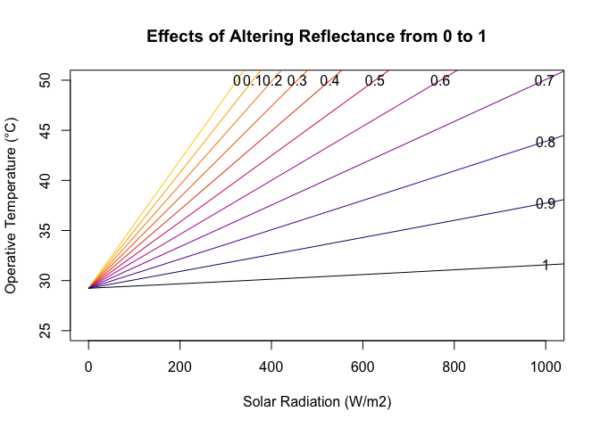<!-- -->

### Model operative temperature with varying wind speeds

``` r
Ts<-40
Ta<-30
SE<-seq(0,1100,100)
Toperative<-NULL
V<-c(0.1,1,2,3,4,5,6,7,8,9,10)

for(V in V){
  temp<-Te(Ts=Ts, Ta=Ta, Tg=NULL, RH=0.5, E=0.96, rho=0.1, cloud=1, SE=SE, V=V, 
           L=0.1, type="forced", shape="vcylinder")
  Toperative<-cbind(Toperative, temp)
}
V<-seq(0,10,1)
Toperative<-data.frame(SE=seq(0,1100,100), Toperative)
colnames(Toperative)<-c("SE", seq(0,10,1))
matplot(Toperative$SE, Toperative[,-1], ylim=c(30, 50), type="l", xlim=c(0,1000),
        main="Effects of Altering Wind Speed from 0 to 10 m/s",
        ylab="Operative Temperature (°C)", xlab="Solar Radiation (W/m2)", lty=1,
        col=flirpal[rev(seq(1,380,35))])
for(i in 2:12){
  ymax<-par()$yaxp[2]
  xmax<-par()$xaxp[2]  
  x<-Toperative[,1]; y<-Toperative[,i]
  lm1<-lm(y~x)
  b<-coefficients(lm1)[1]; m<-coefficients(lm1)[2]
  if(max(y)>ymax) {xpos<-(ymax-b)/m; ypos<-ymax}
  if(max(y)<ymax) {xpos<-xmax; ypos<-y[which(x==1000)]}
  text(xpos, ypos, labels=V[(i-1)])
}
```

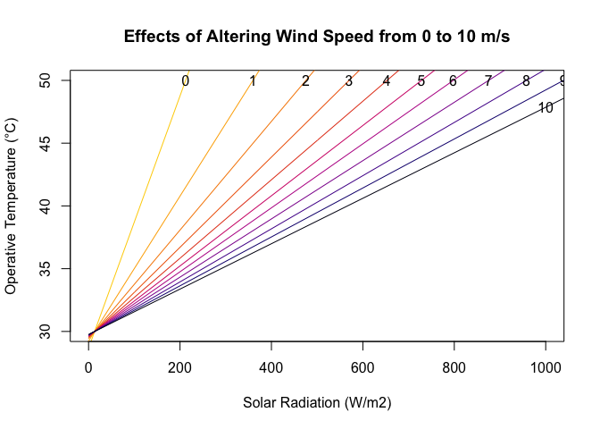<!-- -->

### Model operative temperature with varying RH

``` r
Ts<-40
Ta<-30
SE<-seq(0,1100,100)
Toperative<-NULL
for(RH in seq(0, 1, 0.5)){
  temp<-Te(Ts=Ts, Ta=Ta, Tg=NULL, RH=RH, E=0.96, rho=0.1, cloud=0.5, SE=SE, V=1, 
           L=0.1, type="forced", shape="hcylinder")
  Toperative<-cbind(Toperative, temp)
}
RH<-seq(0, 1, 0.5)
Toperative<-data.frame(SE=seq(0,1100,100), Toperative)
colnames(Toperative)<-c("SE", seq(0,1,0.5))
matplot(Toperative$SE, Toperative[,-1], ylim=c(30, 50), type="l", xlim=c(0,1000),
        main="Effects of changing RH from 0 to 1",
        ylab="Operative Temperature (°C)", xlab="Solar Radiation (W/m2)", lty=1,
        col=flirpal[rev(seq(1,380,35))])
for(i in 2:3){
  ymax<-par()$yaxp[2]
  xmax<-par()$xaxp[2]  
  x<-Toperative[,1]; y<-Toperative[,i]
  lm1<-lm(y~x)
  b<-coefficients(lm1)[1]; m<-coefficients(lm1)[2]
  if(max(y)>ymax) {xpos<-(ymax-b)/m; ypos<-ymax}
  if(max(y)<ymax) {xpos<-xmax; ypos<-y[which(x==1000)]}
  text(xpos, ypos, labels=RH[(i-1)])
}
```

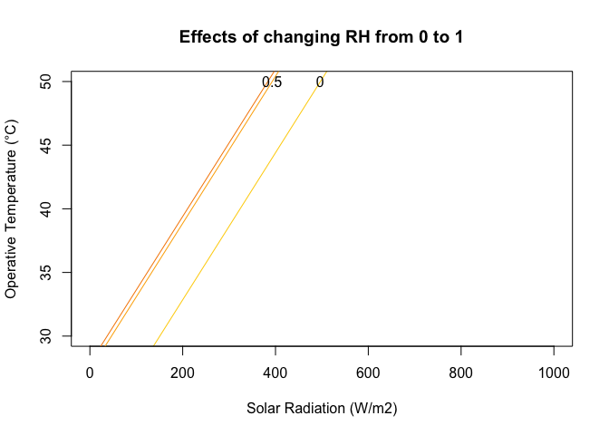<!-- -->

### Model operative temperature with varying cloud cover

``` r
Ts<-40
Ta<-30
SE<-seq(0,1100,100)
Toperative<-NULL
for(cloud in seq(0, 1, 0.5)){
  temp<-Te(Ts=Ts, Ta=Ta, Tg=NULL, RH=0.5, E=0.96, rho=0.5, cloud=cloud, SE=SE, V=1, 
           L=0.1, type="forced", shape="hcylinder")
  Toperative<-cbind(Toperative, temp)
}
cloud<-seq(0, 1, 0.5)
Toperative<-data.frame(SE=seq(0,1100,100), Toperative)
colnames(Toperative)<-c("SE", seq(0,1,0.5))
matplot(Toperative$SE, Toperative[,-1], ylim=c(30, 50), type="l", xlim=c(0,1000),
        main="Effects of changing cloud cover from 0 to 1",
        ylab="Operative Temperature (°C)", xlab="Solar Radiation (W/m2)", lty=1,
        col=flirpal[rev(seq(1,380,35))])
for(i in 2:3){
  ymax<-par()$yaxp[2]
  xmax<-par()$xaxp[2]  
  x<-Toperative[,1]; y<-Toperative[,i]
  lm1<-lm(y~x)
  b<-coefficients(lm1)[1]; m<-coefficients(lm1)[2]
  if(max(y)>ymax) {xpos<-(ymax-b)/m; ypos<-ymax}
  if(max(y)<ymax) {xpos<-xmax; ypos<-y[which(x==1000)]}
  text(xpos, ypos, labels=cloud[(i-1)])
}
```

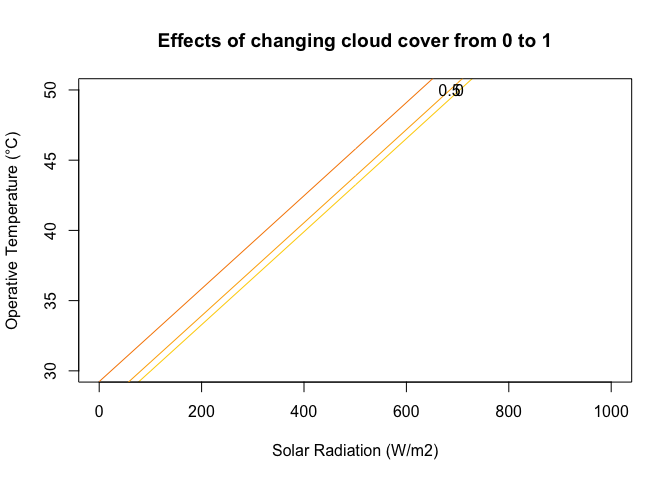<!-- -->

### References

Angiletta, M. J. 2009. Thermal Adaptation: A Theoretical and Empirical
Synthesis. Oxford University Press, Oxford, UK, 304 pp. Gates, D.M.
2003. Biophysical Ecology. Courier Corporation, 656 pp.

Blaxter, 1986. Energy metabolism in animals and man. Cambridge
University Press, Cambridge, UK, 340 pp.

Gates, DM. 2003. Biophysical Ecology. Dover Publications, Mineola, New
York, 611 pp.

Tattersall, GJ, Andrade, DV, and Abe, AS. 2009. Heat exchange from the
toucan bill reveals a controllable vascular thermal radiator. Science,
325: 468-470.

Tattersall GJ, Chaves JA, Danner RM. Thermoregulatory windows in
Darwin’s finches. Functional Ecology 2017; 00:1–11.
<https://doi.org/10.1111/1365-2435.12990>

### Online Resources

The following open source programs and programmers were critical to the
development of Thermimage.

-   Exiftool: <http://www.sno.phy.queensu.ca/~phil/exiftool/>

-   Imagemagick: <http://imagemagick.org>

-   Perl: <http://www.perl.org>

-   raw2temp, temp2raw:
    <https://github.com/gtatters/ThermimageCalibration>

EEVBlog:

-   raw to temperature conversion:
    <http://u88.n24.queensu.ca/exiftool/forum/index.php?topic=4898.135>

-   magicbyte import:
    <http://u88.n24.queensu.ca/exiftool/forum/index.php?topic=4898.0>

-   fileformat:
    <https://www.eevblog.com/forum/thermal-imaging/csq-file-format/>

# Alternative Hex Stickers

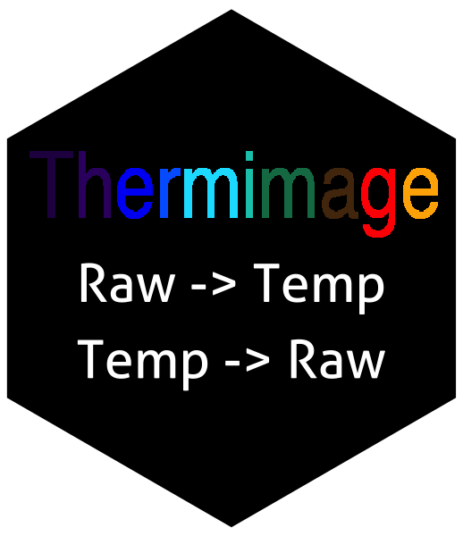

# Previous release notes

2020-08-20: Version 4.1.2 is on Github (development version) - added
error warning when trying to load a non-radiometric image file with
readflirjpg. See issues
[\#7](https://github.com/gtatters/Thermimage/issues/7),
[\#10](https://github.com/gtatters/Thermimage/issues/10),
[\#13](https://github.com/gtatters/Thermimage/issues/13).

-   2019-12-20: Version 4.1.0
    -   added the option to split thermal video files based on different
        filetype/header types. See issue
        [\#9](https://github.com/gtatters/Thermimage/issues/9).
-   2019-11-26: Version 4.0.1
    -   fixed problems with system2 piping calls to ffmpeg on windows
        machines. See issue
        [\#8](https://github.com/gtatters/Thermimage/issues/8). Added
        common perl script to package to facilitate splitting fff, tiff,
        jpegls filetypes. Minor changes to **convertflirVID()** and
        **ffmpegcall()** functions.
-   2019-10-31: Version 4.0.0
    -   Fixed an error/issue
        [\#6](https://github.com/gtatters/Thermimage/issues/6) in
        calculation of the atmospheric tau values, and added the option
        for the user to specify the 5 atmospheric constants (ATA1, ATA2,
        ATB1, ATB2, ATX) supplied in FLIR files. This update makes
        alterations to raw2temp, temp2raw, and flirsettings. Earlier
        versions will have slight error in temperature conversion that
        could be significant for long distances. Users are advised to
        upgrade if they are using object distances &gt;3m for
        calculations.
-   2019-08-17: Version 3.2.2
    -   Added headerindex choice in readflirJPG function as a workaround
        for images that have been captured in dual digital/thermal mode.
        Not fully tested. Default headerindex = 1 so should not break
        other code.
-   2019-05-17: Version 3.2.0
    -   Fixed an issue
        [\#3](https://github.com/gtatters/Thermimage/issues/3) with
        **getTimes()** not working, based on inaccurate
        **frameLocates()**. Completely re-wrote the **frameLocates()**,
        **locate.fid()**, **getTimes()**, and **getFrames()** functions
        to search raw bytes, rather than integers in files and return
        hopefully more robust frame and times. Note: this series of
        functions are hacks and users are advised to use with caution.
-   2019-03-06: Version 3.1.4
    -   Fixed an issue
        [\#2](https://github.com/gtatters/Thermimage/issues/2) with
        **frameLocates()**. This function may not remain in the package
        in the future, especially if file types change. Recommend users
        consider **convertflirVID()** or **convertflirJPG()** instead to
        convert files to an easier to import file type.
-   2019-02-12: Version 3.1.3
    -   Updated help information to point users to the issues link
        (<https://github.com/gtatters/Thermimage/issues>)
-   2018-10-14: Version 3.1.2
    -   Removed stop check in readflirJPG and flirsettings functions for
        troubleshooting custom pathing.
-   2018-09-08: Version 3.1.1
    -   Added minor change to readflirJPG function to accomodate
        whitespace in file pathing. See Issue
        [\#1](https://github.com/gtatters/Thermimage/issues/1)
-   2017-11-28: Version 3.1.0
    -   Added three new functions for converting FLIR jpg, seq, and csq
        files calling on command line tools.
-   2017-10-04: Version 3.0.2
    -   Minor change to getFrames function to provide reverse ordering
        of vector.
-   2017-03-24: Version 3.0.1
    -   Minor fix to frameLocates to allow functionality with certain
        fcf files.
    -   Minor edits to help files. Cautionary notes added to hconv()
        regarding limitations to estimating convection coefficients
        without considering turbulence vs. laminar effects
-   March 2017: Version 3.0.0
    -   Changes in this release include functions for importing thermal
        video files and exporting for ImageJ functionality
    -   Currently testing seq and fcf imports. Please send sample files
        for testing.
-   October 2016: Version 2.2.3
    -   Changes in this release include readflirjpg and flirsettings
        functions for processing flir jpg meta tag info.
